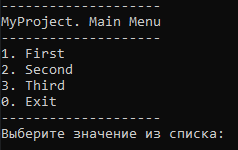

## EasyConsole
Библиотека для разработки консольных приложений на Java

## Стэк
- Java 21 ([JDK](https://www.oracle.com/java/technologies/javase/jdk21-archive-downloads.html))

## Установка без Maven
1. Скачайте [ZIP](https://disk.yandex.ru/d/FBeE7NwvlgZMFA)
2. Распакуйте архив
3. Подключите файл `EasyConsole.jar` к вашему проекту

## Установка с Maven
1. Скачайте [ZIP](https://disk.yandex.ru/d/gXzaV9cCImFFcw)
2. Распакуйте архив
3. Запустите файл `install.bat`
4. Добавьте в файл `pom.xml` вашего проекта следующую зависимость:
```xml
<dependency>
    <groupId>ru.herooo.libs</groupId>
    <artifactId>easy-console</artifactId>
    <version>1.0</version>
</dependency>
```

## Пример использования
Первым делом следует создать абстрактный класс, наследуемый от абстрактного класса `ConsoleFrameAbstract`. Данный класс необходим для фиксации названия приложения на каждом консольном окне.
```Java
public abstract class ConsoleFrameMyProjectAbstract extends ConsoleFrameAbstract {
    public ConsoleFrameMyProjectAbstract(String name) {
        super("MyProject", name);
    }
}
```
Теперь мы можем создавать консольные окна, наследуясь от нашего нового абстрактного класса `ConsoleFrameMyProjectAbstract`. Создадим класс главного меню `ConsoleFrameMain`:
```Java
public class ConsoleFrameMain extends ConsoleFrameMyProjectAbstract {
    public ConsoleFrameMain() {
        super("MainMenu");
    }

    @Override
    public void printContent() {
        while (true) {
            clear();
            printHeader();

            Map<Integer, String> menuMap = new HashMap<>();
            menuMap.put(1, "First");
            menuMap.put(2, "Second");
            menuMap.put(3, "Third");

            printMenu(menuMap, "Exit");
            printDelimiter();
            
            int choice = CONSOLE_SCANNER.waitChoice();
            if (choice == 0) break;
            
            switch (choice) {
                case 1: /* Go to ConsoleFrameFirst */ break;
                case 2: /* Go to ConsoleFrameSecond */ break;
                case 3: /* Go to ConsoleFrameThird */ break;
            }
        }
    }
}
```
Для отображения содержимого необходимо вызвать метод `printContent()` объекта, наследуемого от абстрактного класса `ConsoleFrameAbstract`. Поместим следующий код в метод `main()` нашего приложения:
```Java
public class MyProject {
    public static void main(String[] args) {
        new ConsoleFrameMain().printContent();
    }
}
```
По итогу должно получиться следующее содержимое:



**ВАЖНО!** Некоторые методы классов библиотеки могут работать некорректно при запуске проекта внутри IDE.
